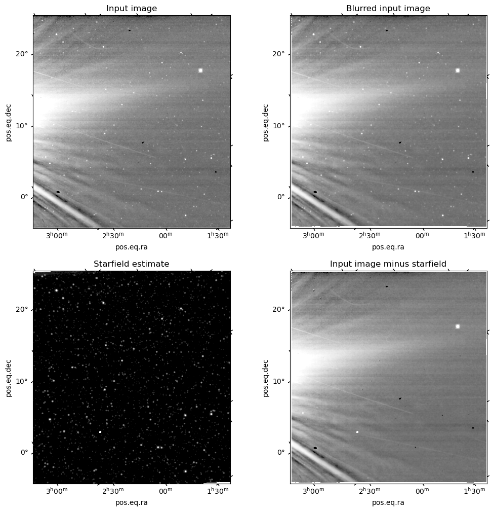

## remove_starfield

This repository contains code which estimates and removes the starfield from a
set of images.

Install the package with `pip install remove_starfield`.

[Read the documentation](https://svank.github.io/remove_starfield/) or look at
the [example notebook](https://github.com/svank/remove_starfield/blob/main/remove_starfield_demo.ipynb).

