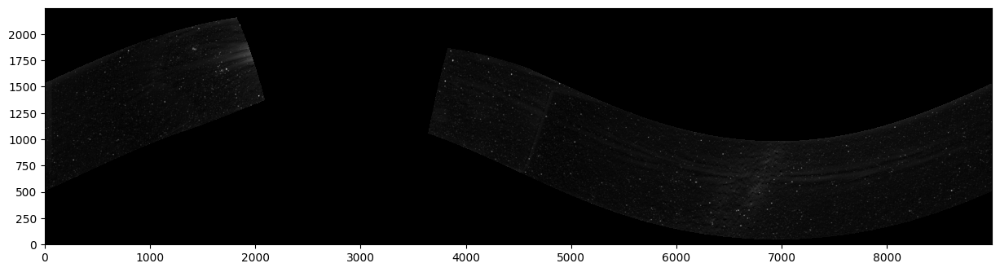

Overview
========

The goal of this package is to estimate the stellar background. In this
context, "stellar background" means any time-steady signal at each fixed
celestial coordinate (i.e. each right ascension--declination coordinate). This
includes both stars and diffuse sources such as the Milky Way, but excludes
planets and any other "foreground" sources, such as the extended solar corona.
Additionally, stellar variability is ignored. This estimating process produces
an all-sky map (or that portion of which your input images cover) of this
estimated background. Once this background map has been produces and processed,
it can be subtracted out of each of the input images.

The intended application of this package is for solar/heliospheric image sets,
in which the stellar background is a contaminant amidst the foreground signal
of the solar corona.

Input data
----------

It is assumed that your input data set is a collection of celestial images in
which large-scale foreground sources (such as the extended solar corona) have
been largely suppressed. These images must have celestial WCS information that
is sub-pixel accurate, and the point-spread function (PSF) must be uniform
across the image plane and from image to image.

Preparing the input data
-------------------------

In many cases, it will be important to pre-process the input data. This can
include steps such as correcting the PSF. Another important factor at this
stage is ensuring that all the input images have the same average background
level (that is, the pixel value where there is no other signal). If your images
tend to have a constant offset from zero and that offset varies through your
image sequence, then in the next step where the images are stacked and a low
percentile is taken, the selected value will be biased toward the
low-background images. This type of time-varying background should be leveled in
this pre-processing stage.

The latter stages will benefit if the input images are as clean as possible.
Planets and any other transients (for WISPR, this includes the frequent debris
streaks) should be masked. (Replacing them with NaNs will have those pixels
ignored in later steps.) Any coronal signals, from both the K and F corona,
should be removed to the extent possible. (With WISPR, I use L3 images where
the F-corona has been estimated and removed, and I subtract from each pixel the
value predicted by a bilinear function fit to the pixel values in a small
region around the pixel--effectively linearizing and subtracting the K corona
from most regions.)

Estimating the starfield
------------------------

The starfield estimate is generated, in short, by reprojecting all the images
into a common all-sky celestial frame, and then reducing the collection of
values at each pixel (i.e. each celestial coordinate) in that frame.

Several reduction functions are provided in this package, and the user can
easily implement their own by subclassing `StackReducer`.

Reduction Methods
,,,,,,,,,,,,,,,,,

Gaussian Reduction
..................

At each output-map pixel coordinate, outliers are iteratively removed from the
set of samples based on a "n standard deviations" criterion. Then the
collection of samples is converted into a histogram, and that histogram is fit
with a Gaussian function, whose center is taken as the estimated background
value. A sqrt(N) weighting has the fit focus mostly on the bins with many
samples. This scheme is ideal of the collection of samples is mostly a noisy
distribution around a single "true" background value.

Note that despite performing individual fits for each pixel in the output map,
this reduction method isn't unduly slow.

Skew-Gaussian Reduction
.......................

This method is very similar to Gaussian reduction, but the fitted function is a
skewed Gaussian, potentially allowing the function to better fit distributions
that resemble a Gaussian-noise distribution of "clean" samples, plus a tail of
brighter samples when foreground signals are present.

Percentile Reduction
....................

At each output-map pixel coordinate, a low percentile value is selected as the
output value. That value is taken
as the "cleanest" sample of the fixed celestial background at that
coordinate---that is, the sample most free of any foreground signal. (Using a
low percentile rather than the minimum reduces the impact of outlier values,
artifacts, and any other oddities.) This may be the ideal reduction method if
many or most samples at each coordinate contain additional contamination and
there are few "clean" samples. This method can be prone to underestimation, as
the low percentile can easily fall on the low-side tail of the distribution of
"clean" samples. This underestimation can be prone to varying based on the
brightness of the pixel in question, as the same distribution of contaminant
signals will be less significant on top of a very bright background, leaving a
larger number of "clean" samples and causing the low percentile to therefore be
further from the center of the "clean sample" distribution. Some success can be
had in fitting a correction factor as a function of pixel brightness that
minimizes the similarity between pixels in an image to be subtracted and the
starfield estimate for that image.

Results
,,,,,,,

This all-sky map shows the estimated stellar background from a large number of
PSP/WISPR images. As PSP sweeps through each of its encounters, the WISPR
camera rapidly pans across the sky (with its pointing always fixed relative to
the spacecraft orientation, which is itself locked to the Sun's direction to
ensure heatshield alignment). This produces the sinusoidal pattern (reflecting
the misalignment between PSP's orbital plane and the Earth axis---and therefore
the RA/Dec equator) and a gap (reflecting the portion of each PSP orbit in
which WISPR is not imaging). The Milky Way can be seen clearly.

Three main artifacts are present:
* At the left-hand edge of the gap, significant coronal signals can be seen, as
those coordinates are only ever imaged very close to the Sun, right before each
WISPR image sequence ends.
* Stretching through the entire sequence about a third of the way down from the
top of the imaged region is a band of dark and light streaks. This is along the
PSP orbital plane which is Venus's orbital plane and is close to the solar
equatorial plane. This ensures a persistent presence of foreground signals,
such as the Venus orbital dust ring and the heliospheric plasma sheet, which in
turn leave artifacts in the background estimate.

Subtracting images
------------------

To remove the stars from an individual image, the starfield estimate is
reprojected into the frame of the target image and subtracted out. The input
image must be adequately prepared first. Some of the pre-processing steps that
were applied to the input images when generating the starfield estimate must
also be applied to the input image in the subtraction stage. This includes
steps such as PSF correction, to ensure that the shapes of stars in the input
image are the same as their shapes in the starfield estimate. The reprojection
used ("adaptive resampling") ensures proper antialiasing, which inherently
produces a slight Gaussian blur in the output image, on the order of a couple
pixels. As the starfield data has been reprojected twice (once into the all-sky
frame and once back into the target image's frame), the input data should also
receive two passes of the same Gaussian blurring, to again ensure that the
shapes of stars line up correctly. This blurring is automatically provided by
`Starfield.subtract_from_image`.

.. figure:: images/demo.png
   :alt: An example of a a subtracted image
   
   An example of an input image (from PSP/WISPR), the corresponding estimated
   starfield, and the result of the subtraction. A few black regions in the
   images mark detector defects, and the large bright "star" in the upper right
   is a planet.

Checking starfield quality
--------------------------

There are two main ways to evaluate the quality of the starfield estimate. The
first is by visually inspecting starfield-subtracted images. This will
immediately reveal significant over- or under-subtractions (i.e. bad estimates
of the star's brightness in the starfield). It will also quickly reveal and
issues with the pointing/coordinate information in your data, as any
misalignments will produce bipoles of over- and under-subtraction, and
time-variation of the alignment will produce "leftover" flux at the location of
bright stars that can be seen to wobble and flicker in a video of subtracted
images.

The other main way is by applying aperture photometry at the locations of known
stars and inspecting

* catalog magnitude values versus the (log of the) measured fluxes in the
  starfield estimate.
* stellar fluxes in the starfield estimate versus those in the input images
* remnant flux in a star's location after subtraction, visualized as a function
  of expected flux values or magnitudes
* remnant flux as a fraction of initial flux, again visualized as a function
  of expected flux values or magnitudes